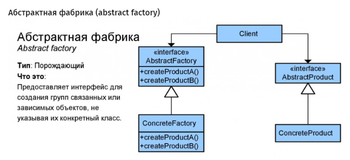

Шаблон: Абстрактная фабрика (Abstract Factory)
=======================================================================================================  
Цель:

Создание интерфейса, для создания множества взаимосвязанных или взаимозависимых объектов, без жёсткой
привязке к конкретным классам.

=======================================================================================================  

Для чего используется:

Для создания множеств взаимосвязанных объектов.

=======================================================================================================  
Пример использования:

- система не должна зависеть от метода создания, компоновки и представления входящих в неё объектов;
- входящие взаимосвязанные объекты должны использоваться вместе;
- система должна конфигурироваться одним из множеств объектов, из которых она состоит;
- нам необходимо предоставить множество объектов, раскрывая только их интерфейсы, но не реализацию.

=======================================================================================================  

Схема:  

