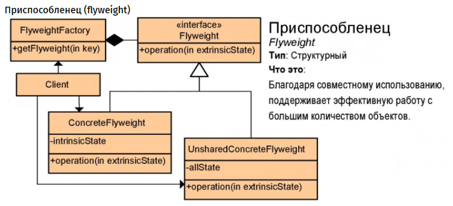

(map of singletons)

Паттерн Приспособленец (Flyweight) - структурный шаблон проектирования, который позволяет использовать разделяемые объекты сразу в нескольких контекстах. Данный паттерн используется преимущественно для оптимизации работы с памятью.

В качестве стандартного применения данного паттерна можно привести следующий пример. Текст состоит из отдельных символов. Каждый символ может встречаться на одной странице текста много раз. Однако в компьютерной программе было бы слишком накладно выделять память для каждого отдельного символа в тексте. Гораздо проще было бы определить полный набор символов, например, в виде таблицы из 128 знаков (алфавитно-цифровые символы в разных регистрах, знаки препинания и т.д.). А в тексте применить этот набор общих разделяемых символов, вместо сотен и тысяч объектов, которые могли бы использоваться в тексте. И как следствие подобного подхода будет уменьшение количества используемых объектов и уменьшение используемой памяти.

Паттерн Приспособленец следует применять при соблюдении всех следующих условий:

Когда приложение использует большое количество однообразных объектов, из-за чего происходит выделение большого количества памяти

Когда часть состояния объекта, которое является изменяемым, можно вынести во вне. Вынесение внешнего состояния позволяет заменить множество объектов небольшой группой общих разделяемых объектов.

Ключевым моментом здесь является разделение состояния на внутренне и внешнее. Внутреннее состояние не зависит от контекста. В примере с символами внутреннее состояние описывается кодом символа из таблицы кодировки. Так как внутреннее состояние не зависит от контекста, то оно может быть разделяемым и поэтому выносится в разделяемые объекты.

Внешнее состояние зависит от контекста, является изменчивым. В применении к символам внешнее состояние может представлять положение символа на странице. То есть код символа может быть использован многими символами, тогда как положение на странице будет для каждого символа индивидуально.

При создании приспособленца внешнее состояние выносится. В приспособленце остается только внутреннее состояние. То есть в примере с символами приспособленец будет хранить код символа.

