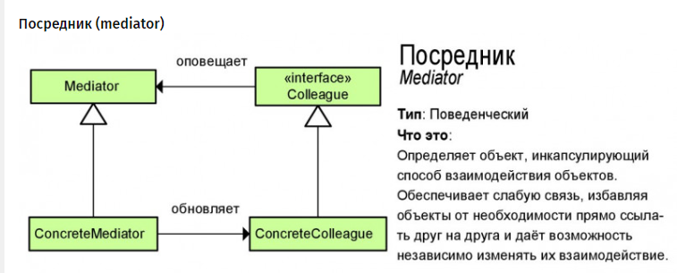

Паттерн Посредник (Mediator) представляет такой шаблон проектирования, который обеспечивает взаимодействие множества объектов без необходимости ссылаться друг на друга. Тем самым достигается слабосвязанность взаимодействующих объектов.

Когда используется паттерн Посредник?

Когда имеется множество взаимосвязаных объектов, связи между которыми сложны и запутаны.

Когда необходимо повторно использовать объект, однако повторное использование затруднено в силу сильных связей с другими объектами.

