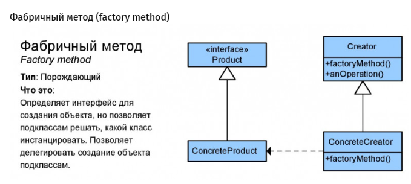

Шаблон: Фабрика (Factory Method)  
=======================================================================================================  
Цель:

Создание интерфейса, который создаёт объект. При этом, выбор того, экземпляр какого класса создавать
остаётся за классами, которые имплементируют данный интерфейс. 
======================================================================================================= 

Для чего используется:

Для делигирования создания экземпляров, другому классу.

=======================================================================================================  
Пример использования:

- заранее неизвестно, экземпляры, какого класса нужно будет создавать;
- класс спроектирован таким образом, что создаваемые им объекты имеют свойства определённого класса.

================================================================================  
Схема:  
